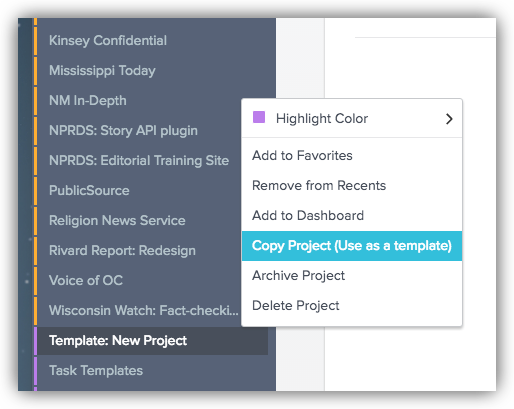
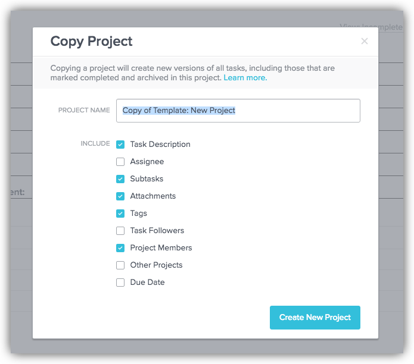
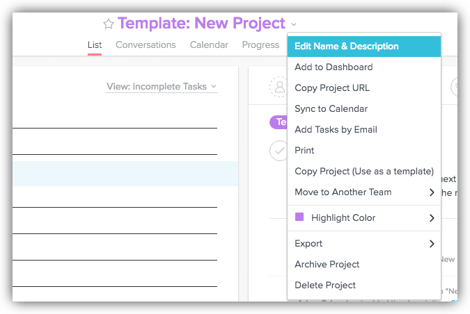
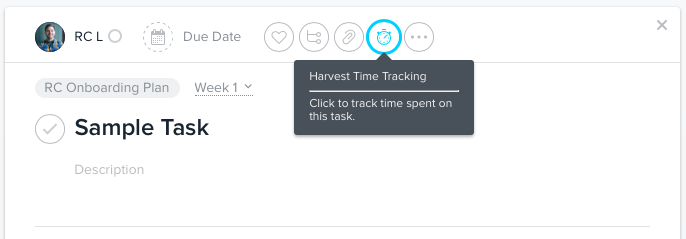

# Project Management with Asana 

The INN Product and Technology team is using [Asana](http://asana.com) as our project/task management tool. It can be great for managing projects and breaking them down into tasks, assigning team members, setting due dates, keeping track of project assets and more. 

It can also generate a lot of noise. Here's how to achieve the former and avoid the latter.

## Scope of this document

We're assuming familiarity with Asana before reading this guide to how we use it at INN. The detailed documentation (which is quite thorough and worth a read) [is located here](https://asana.com/guide).

## New Projects

In the Projects list in Asana, there's a project named **Template: New Project**. Asana allows you to clone an existing project to starta a new project. This is helpful when we're setting up new projects because the default project template already has a bit of structure (for consistency across all of our projects) and also already has all of our team members added to it. 

To clone a project and use it as a template for your new project, hover over the three dots to the right of the project name, click to open the Project Actions menu, and select **Copy Project (Use as a template)**:

This will open the New Project dialogue box where you give it a project name. You can leave the checkboxes as they are and click **Create New Project**.

The new project appears in Asana's project list, yay! We try to keep the projects alphabetized by name, so you can just drag the name of the project around in the list until it appears in the correct spot alphabetically.

### Project Description

After creating a project, give it a short description so it's clear to all concerned what it is. Click on the project name in the Asana project list, then click the dropdown arrow on the right side of its name:

Add the project description, which in most cases should be a single sentence. You can also add this project to your Asana dashboard, give it a different highlight color, etc. Setting a highlight color helps us to quickly distinguish between client projects (orange), internal projects (blue) and templates (purple).

### Adding additional people to a project

By default, each project (assuming you started by cloning the new project template) will already have our immediate team added to it. You might also want to invite additional outside people to the project (client contacts, contractors pitching in on the project, etc.).

To do this, at the top right corner of the screen when you're viewing a project you'll see the number of members currently in the project and a button that says "Add". Just click on that button and you can enter additional email addresses to add new people to the project.

## Project Structure

The default project layout provides a structure for defining tasks:

- New To-Do Items: New tasks that have come in (perhaps from a client) but have not yet been reviewed/scheduled.
- Now: Tasks that are part of the current sprint (due before the next iteration review, typically in a week or two)
- Next: Tasks that will be included in the next sprint. To be reviewed/assigned/scheduled at the next iteration review.
- Upcoming: Tasks that will be included in a future sprint (stuff we know we need to do but have not yet scheduled).
- Backlog: Nice to have items that we may or may not get to depending on the time/budget available for any given project.
- Questions: Questions we have for stakeholders/clients that need to be resolved before defining tasks and scheduling future work
- Project Management: Meetings, communication, etc, e.g. setting up a project Slack channel

You should use this structure to begin creating tasks. 

Tasks define the specific work to be done. If written correctly, completion of all the tasks in a project will complete the project. 

## About Tasks and Subtasks

Each task should require a maximum of eight hours of work. If you think a task will require more than eight hours of work, it should probably either be broken up into multiple tasks or you should create subtasks within that task that are more manageable. (Subtasks can also have sub-subtasks but let's not get crazy.) 

Add descriptions to tasks and subtasks as needed, but generally the subtasks should be written specifically enough to explain themselves. Also include links to example pages, documentation, github issues, etc. wherever relevant so that anyone reviewing the ticket will know what's going on. 

Note that attachments can be added to tasks and subtasks for project resources, documentation, etc. Any files added to a task will also appear in the "files" section of the project so you can find them later.

### Assigning Tasks and Due Dates

Tasks and subtasks should always be assigned to the team member responsible for their completion. You can also add Followers to tasks, who will then be notified when anything is done within that task. This is a great way to keep your team members in the loop and can also be helpful if we need to communicate with a member/client regarding a specific task.

Due dates should be assigned to each task. Typically you'll only want to assign due dates to the parent task and not any subtasks because this can easily clutter up your to-do list and make it difficult to keep track of when the larger task is actually due. 

### Adding Tags to Tasks and Subtasks

Asana provides for adding tags tasks, which makes it easier to identify at a glance things like priority, how long the task is expected to take, if it needs docs or subtasks, etc. 

We use a standard set of tags which are defined in this [sample Asana ticket](https://app.asana.com/0/116212059113593/116212059113594).

Clicking a tag in any task opens other tasks that have that tag. So it's easy to see all tasks that are tagged "Priority" etc.

Definitely use this list to assign tags to tasks and subtasks as you create them, and add them as appropriate.

At a minimum, each task should have a time estimate (15m, 30m, 1h, 2hr, 4h, 8h), a priority (priority: low, priority: normal, priority: high, priority: urgent) and a task type (design, dev, production, support, research, project management, etc.)

There are also various status tags (needs review, needs docs, waiting for approval, in progress, etc.) that can be added as you're working on a ticket to help your team members see, at a glance, where any given ticket stands.

## Time Tracking

Asana has an integration with Harvest that lets you track time right from the Task view in Asana.

Best practice is to start Asana's time tracking when you start work on a task, then stop the clock in Asana when you stop working on that task.

When you create a time log on a task in Asana it will add a link to the time log in Harvest and record the exact time spent on that ticket. You can adjust this time log as needed in Harvest by viewing/editing your timesheet manually.

### Asana/Harvest Time Tracking Gotcha

Due to synch peculiarities, when you stop the clock on a task in Asana then switch over to Harvest, time tracking for that task may look like it's still running. If you refresh the browser tab where you have Harvest, the clock will show that it's been stopped. But if you already stopped the clock in Asana, then stop the clock in Harvest, the Harvest clock for that task will return to 0:00. This leads to incorrect time tracking for the task, and potential billing errors on client projects. 
