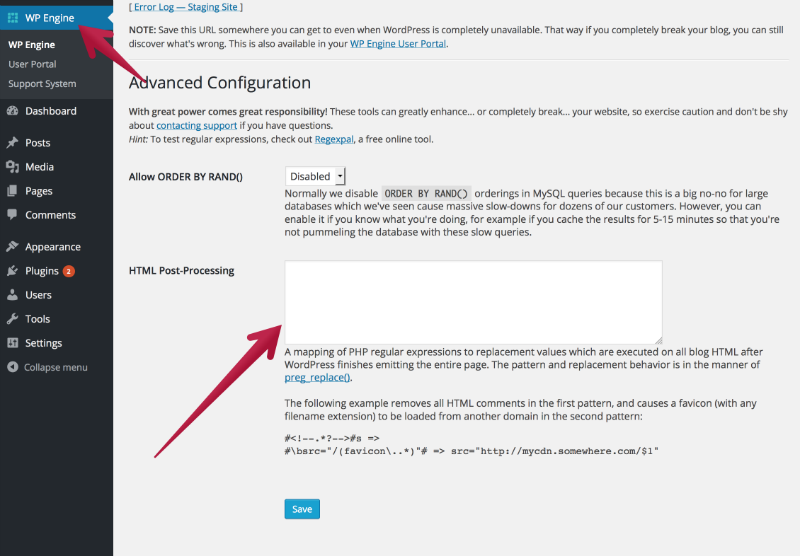

# Installing SSL on WP Engine

### Setup SSL Certificates through LetsEncrypt

1. Log on to the [WP Engine User Portal](https://my.wpengine.com/dashboard)
2. Click your install_name > SSL > Add Certificates.
3. Choose Let's Encrypt free certificate.
4. Select the domains you'd like to add SSL to and click "Request SSL Certificate".
5. It maye take a few minutes for your new SSL certificate to setup. Once this is complete, return to the WP Engine dashboard and check the settings on your new SSL certificate.

### Update WordPress URLs to use SSL

Use wp-cli via WPE's user portal to `search-replace` the `http://example.org/` URLs with `https://example.org/` URLs.

### Setup Content Security Policy

This will prevent cross-site scripting attempts by specifying where a user's browser can load content from.
You can also use this to track any mixed-content errors occurring on the site.

*Need a solution for this - best option so far is https://wordpress.org/plugins/wp-content-security-policy/, but the author abandoned/disappeared ~6months ago*

### Force WP Engine CDN to always load assets over SSL

To do this, we use their HTML Post Processing feature.

In `/wp-admin`, navigate to the WP Engine tab, and scroll down to the **Advanced Configuration** section.

In the **HTML Post-Processing** textarea, enter `#domain\.com/(wp-content/uploads)/# =>ZONE.wpengine.netdna-cdn.com/$1/` and click **Save**.

More information about WP Engine Post Processing can be found at https://wpengine.com/support/html-post-processing/.

### Update Google Analytics & Search Console

Login to Google Analytics and Search Console to update the URL to use `https://`
