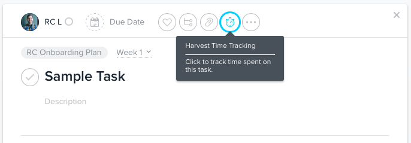

# Time Tracking 

Best practices for tracking time accurately.

### Time Tracking Philosophy

We use [Harvest](https://innnerds.harvestapp.com) to track our time and ensure it is billed accurately to the correct project/client.

You should try to track all of your time to the best of your ability. We have projects & tasks setup in Harvest for just about everything you might need, including projects, meetings, and internal tasks. There will always be some time lost in switching between tasks, which is expected. In general, 32-35 hours logged each week is about normal for us.

### Getting Started

The fastest way to start tracking your time, is to simply login to Harvest and start tracking time there.

Alternatively, [Asana](/how-we-work/asana.md) has an integration with Harvest that lets you track time right from the Task view in Asana. 

FreshDesk also has an integration with Harvest that allows you to track time spent on help desk tickets.

### Submitting Timesheets

Each Friday, you need to submit your timesheet for approval.

To do this:

- Login to Harvest and click on **Timesheets** in the top nav to view your current timesheet.
- At the bottom right, click on **Submit for Approval** to review and submit your timesheet.
- This is a great time to double check and make sure you've captured all of your time for the week, that all of the time logs are attributed to the correct project, etc.

If you submit a timesheet with errors, it may be returned to you with questions/requests for corrections. After you've made those corrections you will need to resubmit it for approval.

Note that it is especially important to have all of your time accurately logged and submitted by the end of the calendar month so we can run invoices and make sure clients are billed accurately.