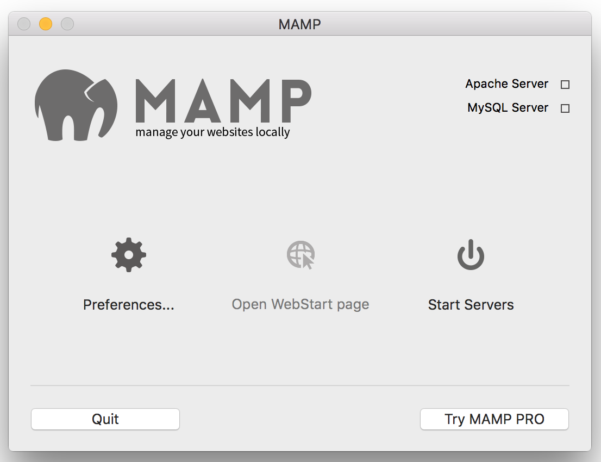
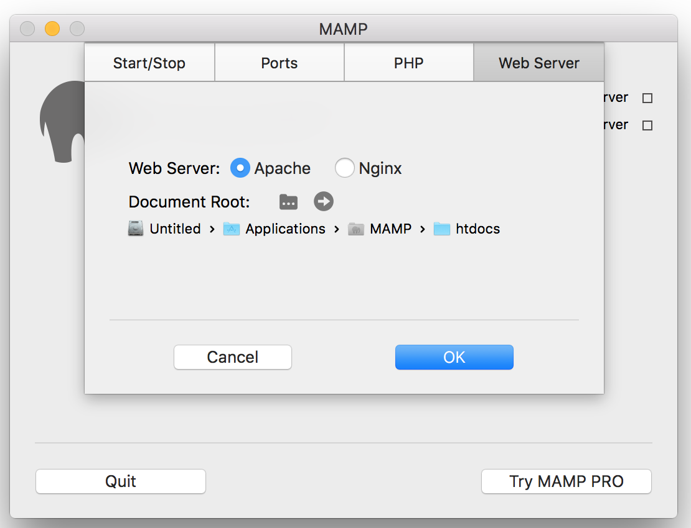

# MAMP Setup Instructions

## Getting Started

- Start by [downloading a copy of the latest version of MAMP](https://www.mamp.info/en/downloads/) from their website and install the software.

Once the software has finished installing and the application launches, you should see something like this:

- Click "Start Servers" and you're ready to go!
- Add some files to your server root at `/Applications/MAMP/htdocs` and visit [http://localhost:8888](http://localhost:8888) to view your server.
- To access server utilities and tools, visit [http://localhost:8888/MAMP/](http://localhost:8888/MAMP/) 
- To access MySQL using phpMyAdmin, visit [http://localhost:8888/phpMyAdmin/](http://localhost:8888/phpMyAdmin/)

## Changing PHP Versions

- From the application home screen (shown above), click on "Preferences".
- Under the PHP tab, select the lower numbered version of PHP. Unless you're specifically using features from a newer version of PHP and have control over your production environment, using a lower version number will help ensure your code respects backwards compatibility and can be run on most servers. 

## Update the Document Root

- From the application home screen (shown above), click on "Preferences".
- Under the Web Server tab, click on the folder icon to select a new location for your web server to point to. This can be anywhere on your computer, but generally it's best to make subfolders in `/Applications/MAMP/htdocs` for each of your projects, and switch between them as needed.
- Once you select a new Document Root, MAMP will restart the server and you can continue working on the new site you just setup. 

